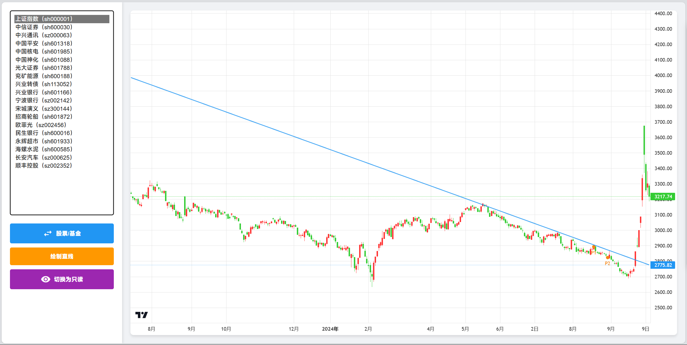

# trade-assistant
一款跨设备的**中国股票及基金**的K线绘制工具，本版本为electron应用，可以在浏览器上打开。*server版本请切换到server分支*

因为Linux的同花顺软件不能画线所以做了这个，还是比较粗糙，但是够用。

截图

特点
- 支持股票和基金
- 信息存入到sqlite中
- 可以自己改样式

不足
- 只获取了一年的数据，不会扩展
- 画线的时候不要在意页面上的提示点，应用会记录你鼠标实际所在的位置。
- 数据库需要初始化几个表，然后把对应的股票信息放进去就行。

使用
1. 下载本项目
2. 进入后`pnpm install`
3. 使用数据库编辑器打开数据库`kLine.db`，把股票信息放入对应表。
4. 运行`pnpm start`
5. 选择sqlite数据库文件并打开。
6. 界面很简单，可以自己探索。
